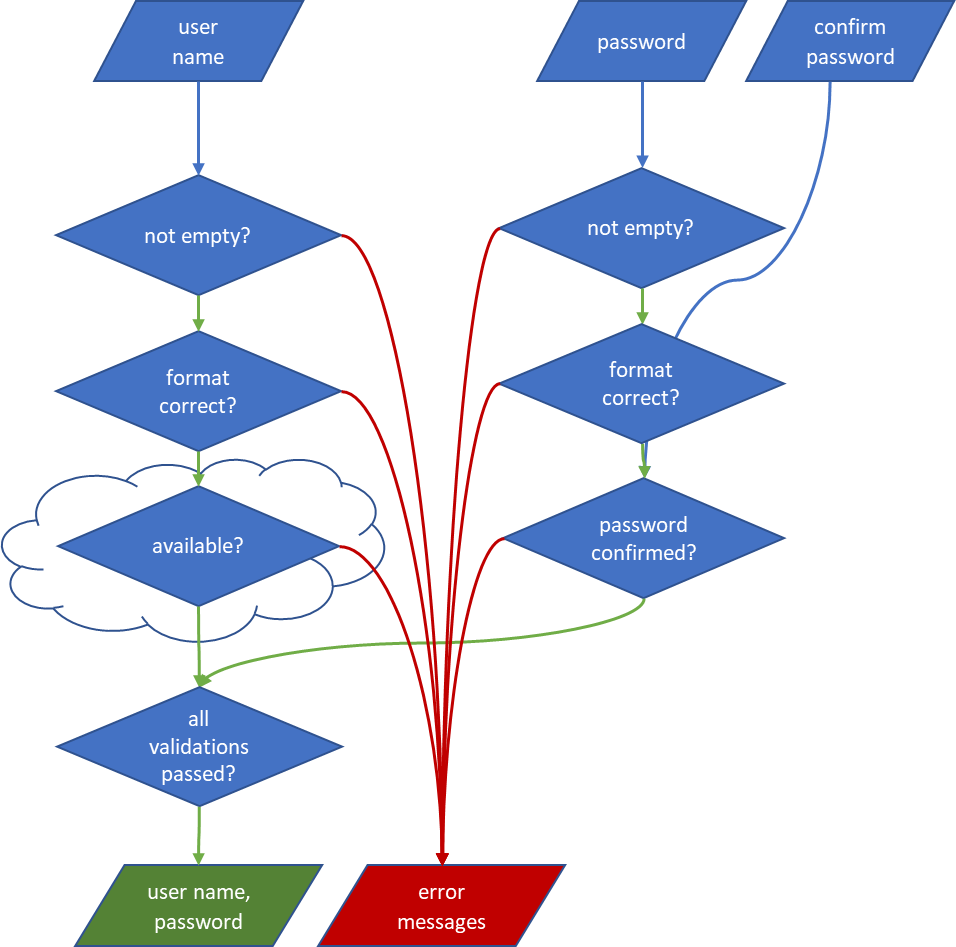

# Monadic promise

This is an example of using Promise as a monad to handle asynchronicity and errors. 
The program is composed of pure functions and const is the only JavaScript keyword used

## Requirements
A validation function:
- Given user name, password and confirm password
- Given a remote service for validating user name availability
- Returns a resolved Promise of [userName, password] if passed the validation
- Returns a rejected Promise of error messages if validation failed
- See the flowchart and [test cases](./src/validate-user.test.js) for details

